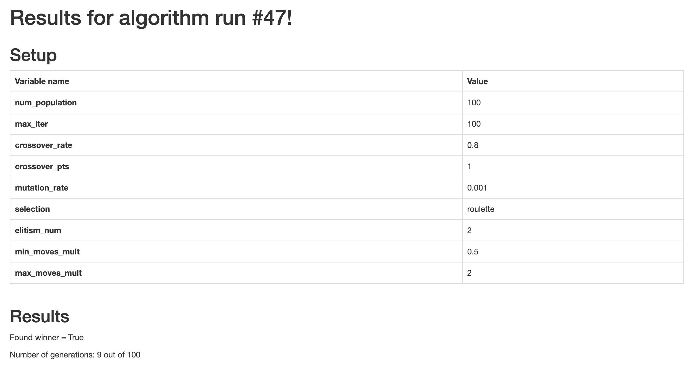
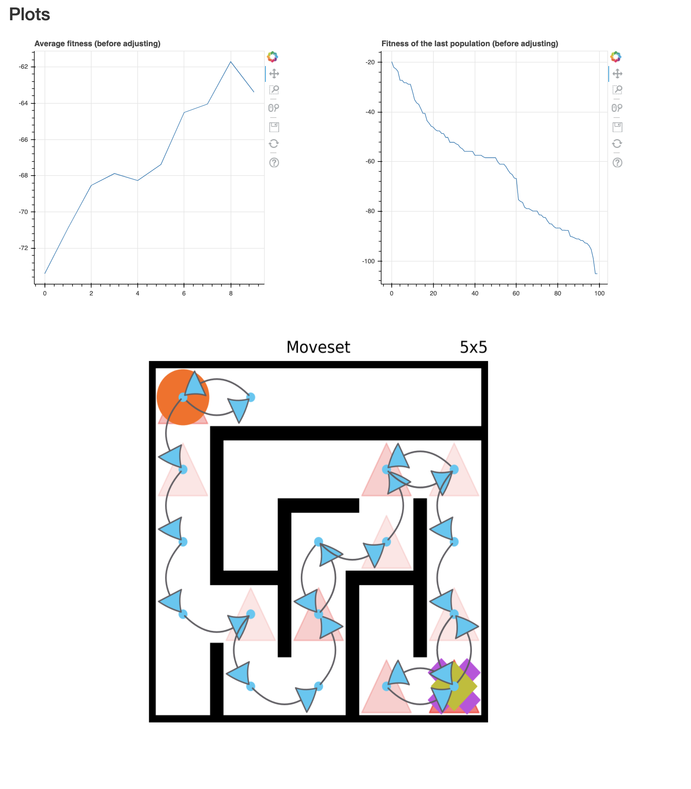
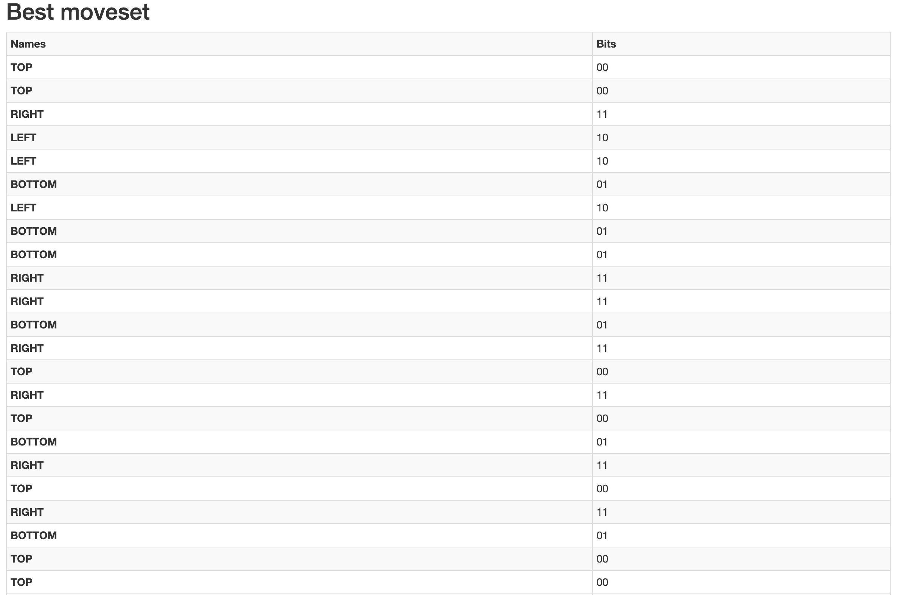

# Labyrinther - solving mazes with GA in Python

# What and why?

This is a project developed for an undergraduate course "Introduction to Artificial Intelligence" in Wrocław University of Science and Technology. 

The task given to us was to make a program that would solve mazes using a genetic algorithm, representing the path itself as a sequence of bits (2 bits is enough to encode top/bottom/left/right). 

This application serves as a Flask server that gives you access to a console (`http://127.0.0.1:5000/`) allowing you to run different simulations. While you have to provide a maze that the algorithm will solve, there are some example mazes (2x2, 3x3, 5x5 and 10x10) in the project itself, in the directory `example_labyrinths`.
If you want to make your own maze, please look at the format that the mazes have in `example_labyrinths` or edit them to your liking.

Once simulated, you can view the performance of the resulting algorithm as well as the steps that it took (`http://127.0.0.1:5000/<simulation-id>`, ex: `http://127.0.0.1:5000/47`)

# Screenshots

