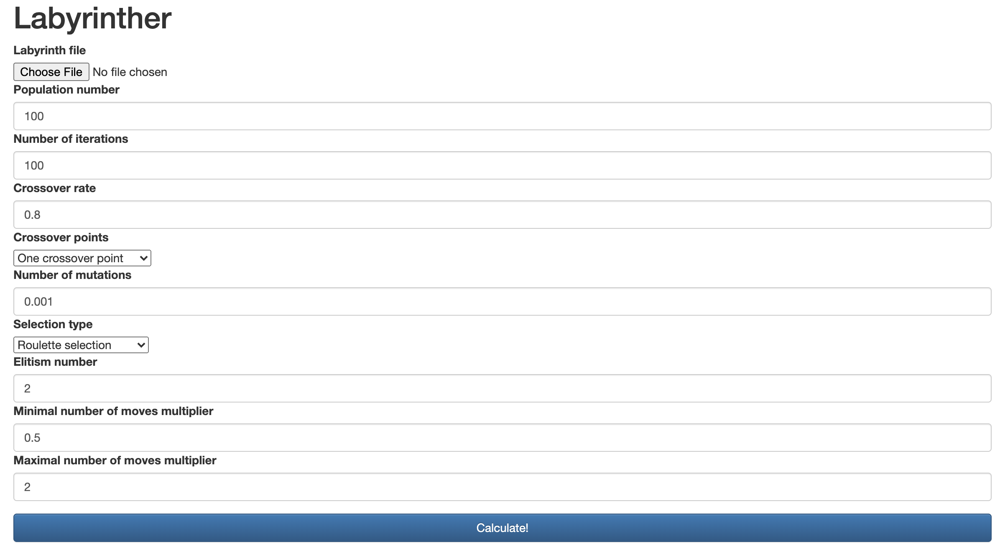

# Labyrinther - solving mazes with GA in Python

## What and why?

This is a project developed for an undergraduate course "Introduction to Artificial Intelligence" in Wrocław University of Science and Technology. 

The task given to us was to make a program that would solve mazes using a genetic algorithm, representing the path itself as a sequence of bits (2 bits is enough to encode top/bottom/left/right). 

This application serves as a Flask server that gives you access to a console (`http://127.0.0.1:5000/`) allowing you to run different simulations. While you have to provide a maze that the algorithm will solve, there are some example mazes (2x2, 3x3, 5x5 and 10x10) in the project itself, in the directory `example_labyrinths`.
If you want to make your own maze, please look at the format that the mazes have in `example_labyrinths` or edit them to your liking.

<p align="center">
<br/>
<sup>Setting up the simulation</sup>
</p>

Once simulated, you can view the performance of the resulting algorithm as well as the steps that it took (`http://127.0.0.1:5000/<simulation-id>`, ex: `http://127.0.0.1:5000/47`)

<p align="center">
<br/>
<sup>Result page (1) - Set up values and winner status</sup>
</p>


<p align="center">
<br/>
<sup>Result page (2) - Progression charts</sup>
</p>

In the chart above, orange circle marks the start of the labyrinth, gold square - its end, red triangle means marks a point where one iteration of the algorithm died, and the purple X - the final point of the final iteration of the algorithm.

<p align="center">
<br/>
<sup>Result page (3) - Final algorithm steps</sup>
</p>

## How to run

```
pip3 install -r requirements.txt
python3 run.py
```
